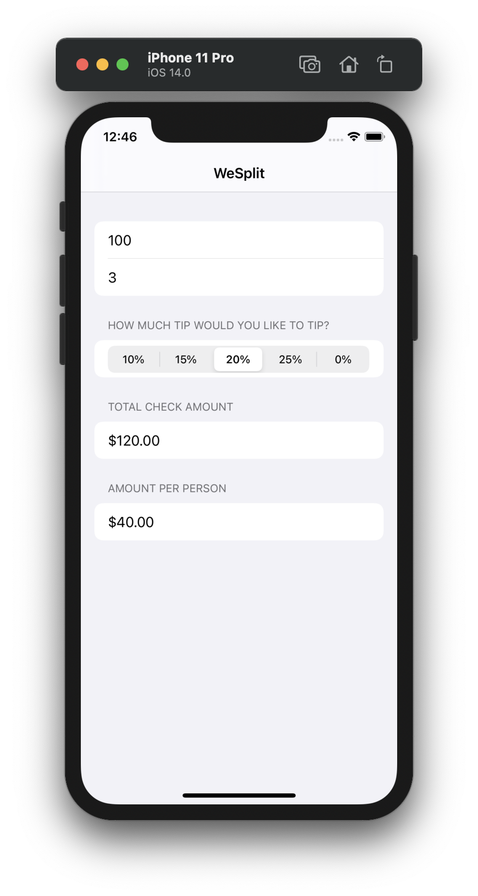

# 🤑 WeSplit
[](https://swift.org)

A test project in which I am learning the SwiftUI framework.
The project is part of Paul Hudson's training cycle - 100 Days of SwiftUI

  <p float="right">
  
  </p>
  

## 🏃‍♂️ Getting Started

``` bash
git clone https://github.com/johnnieWa1ker/WeSplit.git
cd WeSplit
pod install
open WeSplit.xcodeproj.
```

## 🎉 Why am I building this?
1. I am very interested in the SwiftUI framework from Apple, I believe that after a while it will become quite powerful so that you can quickly make cool projects with it
1. I want to master the 100 Days SwiftUI marathon 🏃‍♂️
